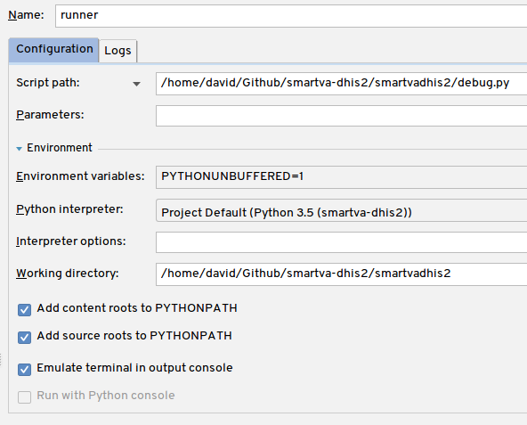

Development
===========

Follow instructions in :doc:`/installation`, but install it with ``--dev -e .`` flag:

.. code:: bash

    pipenv install --ignore-pipfile --dev -e .

Entry point for the code is at ``__main__.py``.

Testing
--------
`pytest <https://docs.pytest.org/en/latest>`_ is used for Unit testing.

.. code:: bash

    pipenv run python setup.py test

Debugging
----------

In order to debug the module, you can create a file called ``debug.py`` next to ``__main__.py`` (with same code content)
and create a debug profile in PyCharm like this:

Releasing
----------
- Use `Semantic Versioning <https://semver.org/spec/v2.0.0.html>`_:

        "Consider a version format of X.Y.Z (Major.Minor.Patch). Bug fixes not affecting the API increment the patch version,
        backwards compatible API additions/changes increment the minor version,
        and backwards incompatible API changes increment the major version."

        -- https://semver.org

Commandline interface
----------------------

- delete ALL events (asks first)
- export program metadata w/ dependencies
- print error categories (exceptions)

::

    pipenv run python smartvadhis2/cli.py --help
    usage:

    --delete_events       Delete all events
    --download_program_metadata
                          Download DHIS2 program metadata
    --print_error_categories
                          Print error categories inserted into the database

Updating Documentation
-----------------------

- add RestructuredText files (like this one) to ``docs`` and link them in ``index.rst``
- ``pipenv shell``, then ``cd docs`` and finally ``make html``